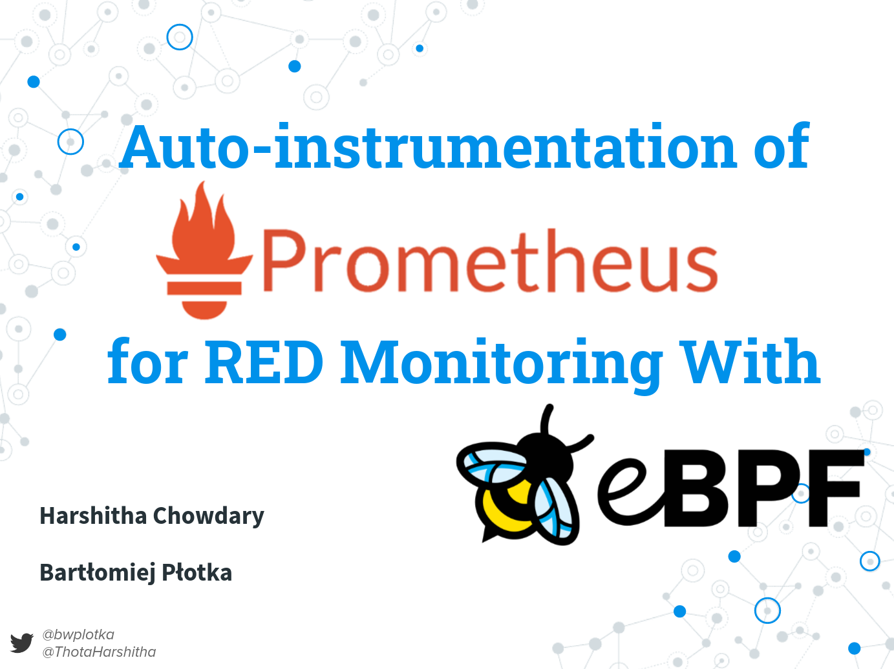
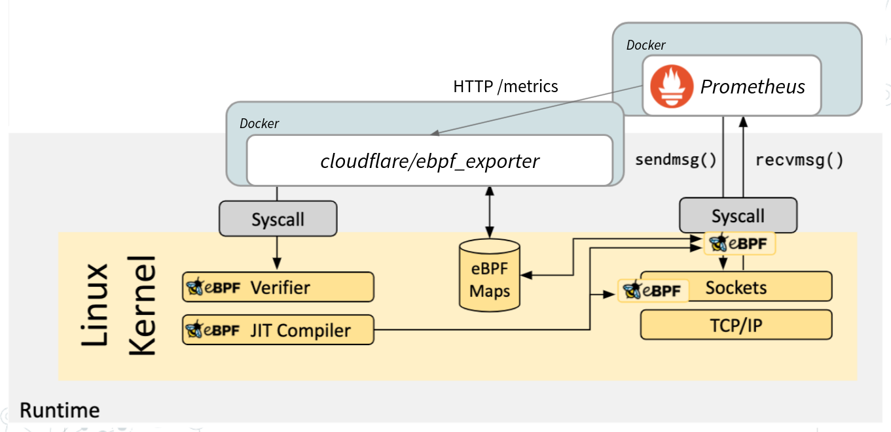

# Demo of ebpf-instrumentation

This repository holds demonstration materials for [@bwplotka](https://bwplotka.dev) and [@Harshitha1234](https://github.com/Harshitha1234) talk "Auto-instrumentation of Prometheus For RED Monitoring With eBPF".

We hope it will get your started quicker with eBPF!

## Demo Architecture

Demo is scripted using our [Go e2e framework](https://github.com/efficientgo/e2e) inside standard Go test framework. You can see the implementation [here](./examples/ebpf_test.go)

In principle, we want to show IF and HOW to monitor HTTP requests using [RED method](https://grafana.com/blog/2018/08/02/the-red-method-how-to-instrument-your-services/) without any service mesh or application (open box) instrumentation. We deploy all in docker containers to simulate that all can be working on complex cloud native environments (e.g. Kubernetes).

So without eBPF, Prometheus is nice enough to expose metrics about its own HTTP traffic (who many queries or other APIs requests were made and handled). The metrics we are interested are under `prometheus_http_requests_total` metric name. To obtain them is as easy as Prometheus scraping its own metrics, so we can query them. 

Unfortunately, this is not always the case. Other processes might not have such metrics or use different behaviour on them which is very painful for anyone operating this software. Service mesh helps but it's extra complexity, cost and maintenance burden and we still we might not have all the visibility.

In this demo we will try to show same behaviour metrics using eBPF and compare it with Prometheus native instrumentation.

During this demo we:

1. Deploy [Prometheus](https://github.com/prometheus/prometheus) docker container that scrapes itself (!) and ebpf exporter.
2. Get Prometheus process ID (PID) from host perspective.
3. Deploy [ebpf_exporter](https://github.com/cloudflare/ebpf_exporter) docker container with special privileges (volumes, privileged mode and capabilities) our configuration.
 * In this configuration we specify metrics we want to expose and what eBPF map we should attach to.
 * We specify what way we want to hook in to the kernel with our eBPF program; In this example we will use Syscall tracepoints.
 * We specify the program itself, but before we inject Prometheus PID, since we want to filter HTTP traffic only from our Prometheus server.
4. We open Prometheus UI to explore metrics, plus we do some calls to mimic simple HTTP traffic.

## Limitations

* This demo works on my machine ™️ (trust me): `Linux pop-os 5.11.0-7620-generic #21~1626191760~20.10~55de9c3-Ubuntu SMP Wed Jul 21 20:34:49 UTC  x86_64 x86_64 x86_64 GNU/Linux`. Due to eBPF requiring kernel headers and function signatures from exactly the kernel version it will be running in, this demo is unlikely portable. You can try to build your own ebpf-exporter docker image with your own kernel headers based on my [Dockerfile](exporter/Dockerfile) and then `make docker` from repo. This is fine if you control your kernel version in your cluster.
* Method we chose (tracepoints on `write`, `read`, `close` syscalls) works with plain HTTP, but not with TLS. For TLS we would need to switch to [uprobes on OpenSSL method](ttps://blog.px.dev/ebpf-openssl-tracing//) or `uprobes` hooked into go specifically. Doable.
* We did not implement "duration" element of the RED method. This would need to be added to our eBPF program. Doable too (:

## How To Use it?

* Build ebpf_exporter docker container image: `make docker`
* Run example `make run-example`

## Useful links that helped us create this talk

There is a lot of prior work and amazing tutorials that helped us make this demo:
 
* https://github.com/prometheus/prometheus
* https://github.com/cloudflare/ebpf_exporter
* https://github.com/ahas-sigs/kube-ebpf-exporter (specifically https://github.com/ahas-sigs/kube-ebpf-exporter/commit/3d747fbe9941afae0cbb03c21b2c2a02730dd969)
* https://github.com/josecv/ebpf-userspace-exporter
* https://github.com/iovisor/bcc/blob/master/docs/reference_guide.md
* https://www.youtube.com/watch?v=-I29Cuj2nbI
* https://kubernetes.io/blog/2017/12/using-ebpf-in-kubernetes/
* https://github.com/torvalds/linux/blob/v4.8/include/uapi/linux/bpf.h#L90-L98
* https://www.brendangregg.com/Perf/bcc_tracing_tools.png
* https://github.com/iovisor/bcc/tree/master/tools
* https://blog.px.dev/ebpf-http-tracing/
* https://qmo.fr/docs/talk_20200202_debugging_ebpf.pdf
* https://www.kernel.org/doc/html/v5.11/trace/events.html
* https://stackoverflow.com/a/47991968/3220609
* https://linux.die.net/man/2/accept4
* http://www.scs.stanford.edu/06au-cs240/notes/l3.pdf
* https://github.com/iovisor/bcc/blob/master/examples/networking/http_filter/http-parse-complete.c
* https://blog.px.dev/ebpf-openssl-tracing/